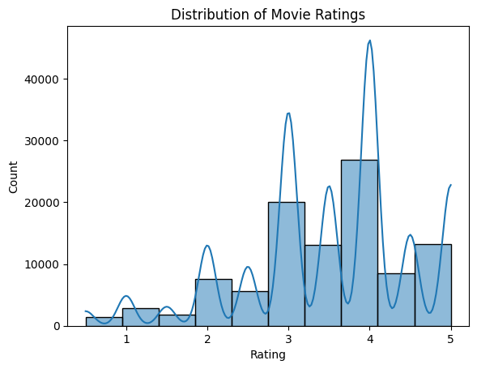
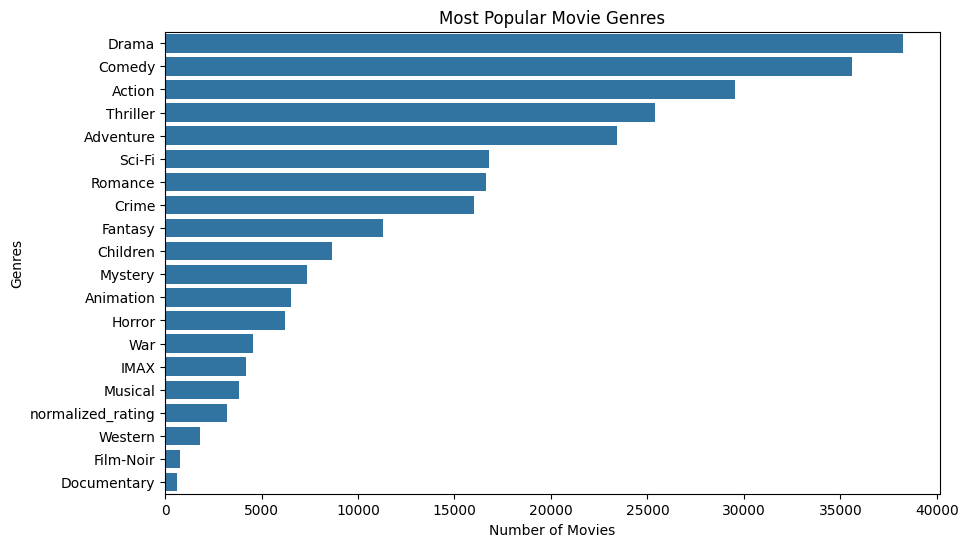
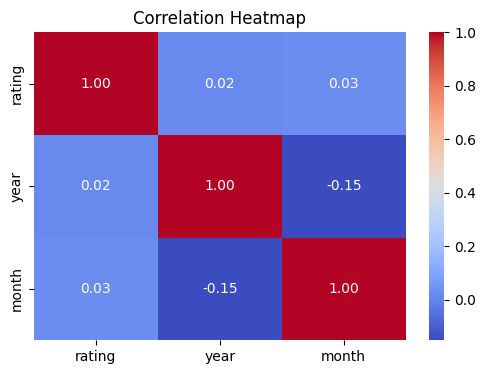
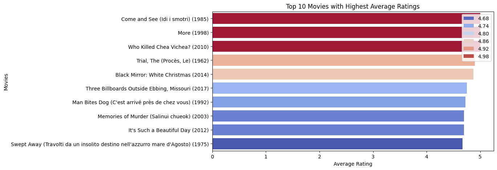
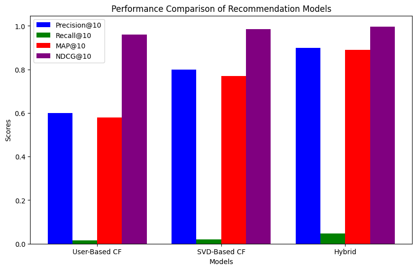
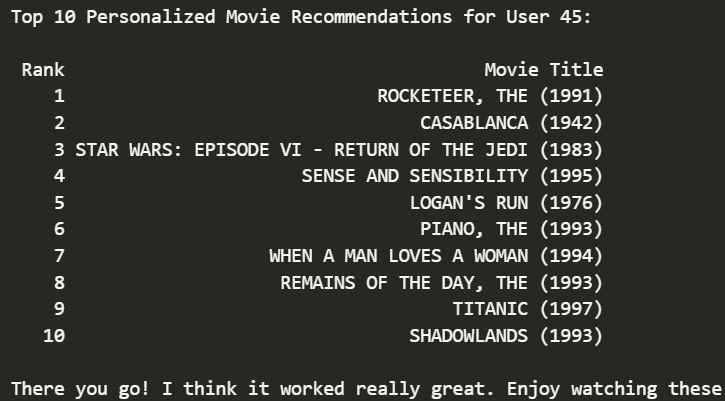

# 🎬 Movie Recommendation System

## 📌 Project Overview
With streaming platforms offering an overwhelming number of movie choices, users often struggle to find content that aligns with their preferences. This project develops an **intelligent Movie Recommendation System** that personalizes suggestions using **machine learning** techniques, leveraging the **MovieLens dataset** to analyze user ratings and movie attributes.

The project explores various **recommendation algorithms**, ranging from **content-based filtering** to **collaborative filtering**, and ultimately integrates a **hybrid approach** for optimal results. 

## 🎯 Business Understanding
### **Problem Statement**
In an age where content overload is a challenge, users need an efficient way to discover movies they will enjoy. This system aims to:
- Analyze user preferences based on historical ratings.
- Generate accurate recommendations while maintaining diversity.
- Address common challenges such as the **cold start problem** and **data sparsity**.

### **Key Objectives:**
1. Develop an automated recommendation system that learns from user interactions.
2. Evaluate multiple recommendation techniques to determine the most effective approach.
3. Improve user engagement by suggesting relevant, high-quality movie content.
4. Enable real-time, scalable deployment for seamless integration with streaming services.

## 📊 Data Understanding
### **Dataset: MovieLens**
The **MovieLens dataset** provides a rich collection of movie ratings and metadata, making it ideal for recommendation system research. The dataset contains:
- **User Ratings:** Numerical ratings provided by users for different movies.
- **Movie Metadata:** Titles, genres, and release information.
- **User Information:** Anonymous identifiers to track preferences and interactions.

### **Exploratory Data Analysis (EDA)**
Before developing the recommendation models, we conducted an extensive **Exploratory Data Analysis (EDA)** to uncover patterns and insights. 
#### Key Insights:
- The dataset contains **thousands of unique users and movies**, requiring efficient filtering techniques.
- **Rating distributions** reveal biases where certain genres receive consistently higher ratings.
- **Movie popularity** varies significantly, affecting the recommendations' effectiveness.
- **Sparse Data Challenge:** Many users rate only a small fraction of movies, making collaborative filtering complex.

**1. Distiribution of movie rating**

**2. Most popular movies genres**

**3. Correlation heatmap for numerical features**

**4. Top 10 movies with highest ratings**

## 🏗 Methodology
The recommendation system was built using the following approaches:

### **1️⃣ Content-Based Filtering**
- Utilizes **TF-IDF Vectorization** and **Cosine Similarity** to match movies based on metadata such as genres, actors, and directors.
- Provides recommendations that are **similar to previously watched/rated movies**.
- Strengths: Works well for users with unique preferences.
- Weaknesses: Limited exploration of new, unseen content.

### **2️⃣ Collaborative Filtering**
- Leverages user interaction data to suggest movies that similar users have enjoyed.
- **Matrix Factorization** techniques such as **Singular Value Decomposition (SVD)** and **Alternating Least Squares (ALS)** improve recommendation accuracy.
- Strengths: Learns patterns from large-scale user interactions.
- Weaknesses: Suffers from **cold start** problems for new users.

### **3️⃣ Hybrid Recommendation Model**
- **Combines content-based and collaborative filtering** to improve relevance and diversity.
- Implements **weighted scoring methods** and **feature fusion**.
- Strengths: Addresses the shortcomings of both standalone approaches.

### **4️⃣ Advanced Techniques Considered**
- **Deep Learning-based recommendations** using Neural Networks.
- **Graph-based techniques** to capture complex relationships between users and movies.

## 📏 Evaluation Metrics
To measure the effectiveness of recommendations, we use:
- **RMSE (Root Mean Squared Error):** Measures prediction accuracy.
- **Precision & Recall:** Evaluates recommendation relevance.
- **NDCG (Normalized Discounted Cumulative Gain):** Measures ranking quality.
- **Serendipity & Diversity Scores:** Ensures recommendations are varied and not repetitive.

## 📊 Results

## 🚀 Implementation & Deployment
This system is implemented using:
- **Python** (Pandas, NumPy, Matplotlib, Seaborn)
- **Machine Learning Frameworks:** Scikit-learn, Surprise
- **Deep Learning (Optional):** TensorFlow, PyTorch
- **Deployment Tools:** Flask, FastAPI (for interactive recommendation APIs)

**Deployment Workflow:**
1. **Model Training:** Preprocessing, training, and tuning the recommendation model.
2. **Evaluation:** Assessing performance using test datasets.
3. **Integration:** Deploying as a microservice accessible via REST API.
4. **User Feedback Loop:** Updating recommendations based on real-time interactions.

## 🔥 Challenges & Future Enhancements
### **Current Challenges**
- **Cold Start Problem:** New users with minimal data receive less personalized recommendations.
- **Scalability:** Handling millions of users and movies in real-time.
- **Bias in Recommendations:** Popular movies dominate the results, reducing diversity.

### **Future Improvements**
- **Incorporating Sentiment Analysis:** Using user reviews for richer recommendation insights.
- **Hybrid Deep Learning Models:** Exploring Neural Collaborative Filtering (NCF) for enhanced accuracy.
- **Graph-based Models:** Utilizing Graph Neural Networks (GNNs) for advanced personalization.
- **Reinforcement Learning:** Implementing real-time learning based on user interactions.

## 🎥 Example Recommendations

## 👨‍💻 Technologies Used
- **Python** (Pandas, NumPy, Matplotlib, Seaborn)
- **Machine Learning** (Scikit-learn, Surprise, TensorFlow, PyTorch)
- **Recommendation Algorithms** (SVD, ALS, Hybrid Approaches)
- **Deployment** (Flask, FastAPI, Docker)

## 📜 References
- MovieLens Dataset: [https://grouplens.org/datasets/movielens/](https://grouplens.org/datasets/movielens/)
- Research on Recommendation Systems

